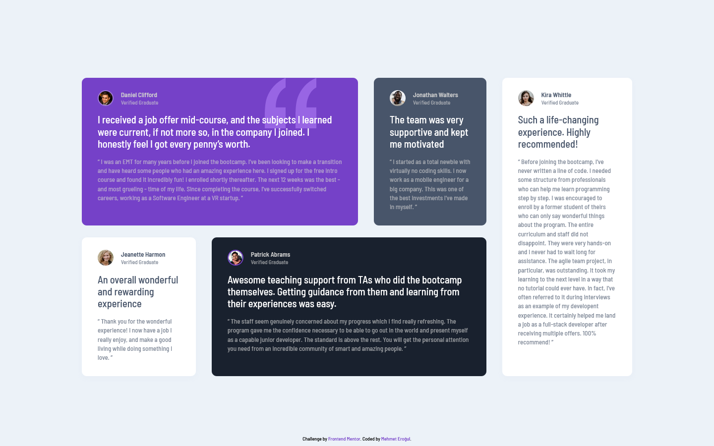

# Frontend Mentor - Testimonials grid section solution

This is a solution to the [Testimonials grid section challenge on Frontend Mentor](https://www.frontendmentor.io/challenges/testimonials-grid-section-Nnw6J7Un7). Frontend Mentor challenges help you improve your coding skills by building realistic projects.

## Table of contents

- [Overview](#overview)
  - [The challenge](#the-challenge)
  - [Screenshots](#screenshots)
  - [Links](#links)
- [My process](#my-process)
  - [Built with](#built-with)
- [Author](#author)

## Overview

### The challenge

Users should be able to:

- View the optimal layout for the site depending on their device's screen size

### Screenshots

### Links

- Live Site URL: [Github Pages](https://mehmeterogul.github.io/testimonials-grid-section/)

## My process

### Built with

- Mobile-first workflow
- Flexbox
- CSS Grid
- CSS custom properties

## Author

- Frontend Mentor - [@mehmeterogul](https://www.frontendmentor.io/profile/mehmeterogul)
- LinkedIn - [@mehmet-erogul](https://www.linkedin.com/in/mehmet-erogul)
- Twitter - [@MehmetErogul96](https://www.twitter.com/MehmetErogul96)
